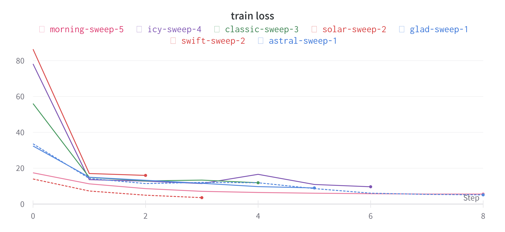
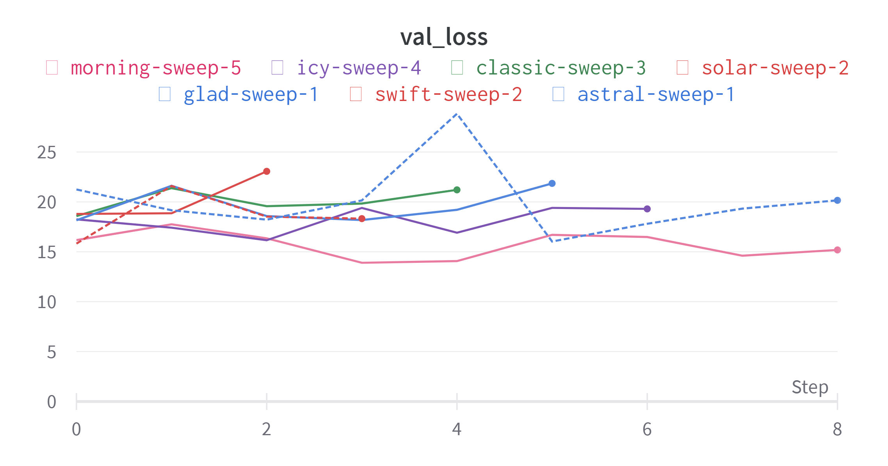
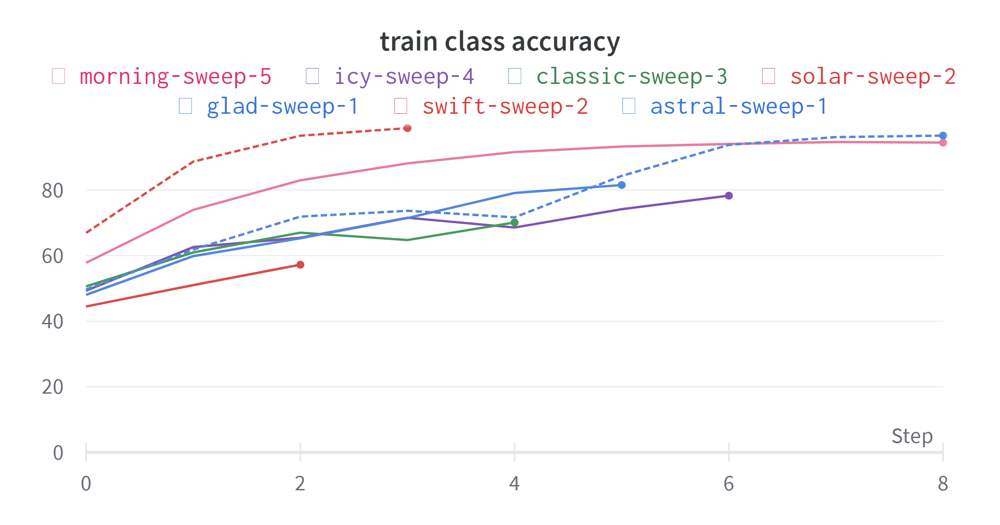
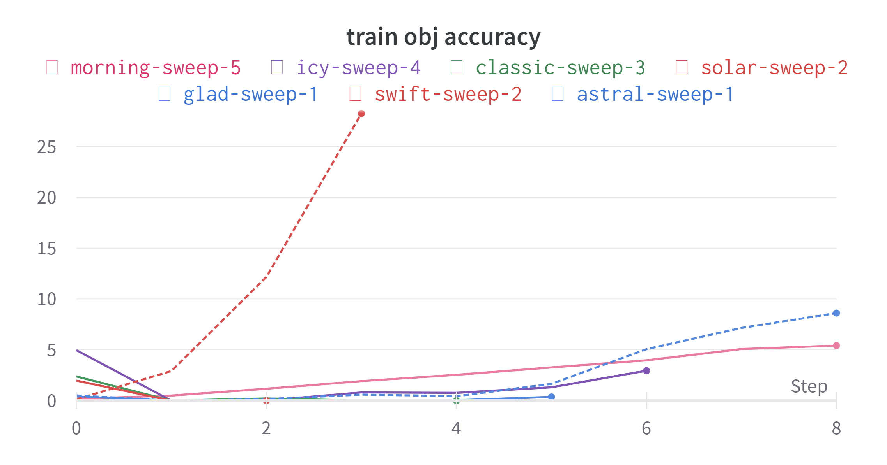
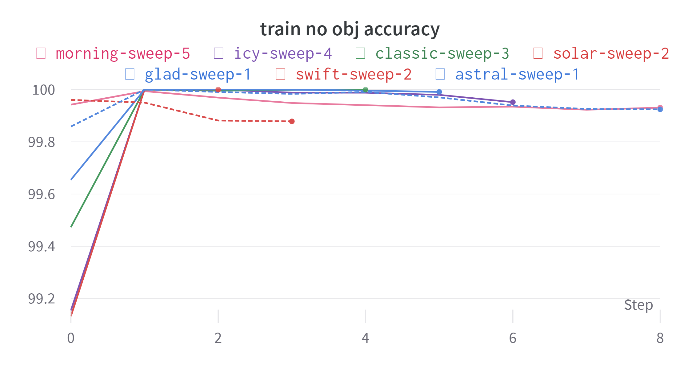

# Bounding box detection

## Authors
 - [Erik Matovič](https://github.com/Matovic)
 - Jakub Horvat 

## Solution
Používame PIE dataset z  [pie_data Python file](./src/pie_data.py) na vytvorenie trénovacích, testovacích a validačných dát. Pre extrahovanie anotácii je vytvorený pie_data súbor.

### 1. Exploratory Data Analysis & Data Transformations
Ukážka z  [PIE dataset videos](https://data.nvision2.eecs.yorku.ca/PIE_dataset/):
 <p align="center">
	
</p>

Z PIE datasetu sme extrahovali a uložili malú časť obrázkov a ich anotácii. Konkrétne trénovacích bolo 1779, validačných 743 a testovacích 1401. Každá časť anotácii obsahuje csv súbor, ktorý pozostáva z dvoch stĺpcov - stĺpec pre cestu k obrázku a stĺpec pre cestu k anotácii k obrázku.

Každý obrázok mal vlastný txt súbor, v ktorom každý riadok opisuje jeden bounding box v obrázku. Formát riadku je:
- trieda
- x bboxu
- y bboxu
- šírka bboxu
- výška bboxu


### 2. Data Preprocessing
Na predspracovanie a augmentáciu sme použili knižnicu albumentations, ktorá pri načítaní obrázka augmentuje obrázok s určitou pravdepodobnosťou rôznych možností.
```python3
train_transforms = A.Compose(
    [
        A.LongestMaxSize(max_size=int(IMAGE_SIZE * scale)),
        A.PadIfNeeded(
            min_height=int(IMAGE_SIZE * scale),
            min_width=int(IMAGE_SIZE * scale),
            border_mode=cv2.BORDER_CONSTANT,
        ),
        A.RandomCrop(width=IMAGE_SIZE, height=IMAGE_SIZE),
        A.ColorJitter(brightness=0.6, contrast=0.6, saturation=0.6, hue=0.6, p=0.4),
        A.HorizontalFlip(p=0.5),
        A.Blur(p=0.1),
        A.CLAHE(p=0.1),
        A.Posterize(p=0.1),
        A.ToGray(p=0.1),
        A.ChannelShuffle(p=0.05),
        A.Normalize(mean=[0, 0, 0], std=[1, 1, 1], max_pixel_value=255,),
        ToTensorV2(),
    ],
    bbox_params=A.BboxParams(format="yolo", min_visibility=0.4, label_fields=[],),
)
```
### 3. Model

Na detekciu bounding boxov v obrázku sme použili architektúru inšpirovanú detekčnou sieťou YOLO v3.
 <p align="center">
	
</p>
 <p align="center">
	
</p>

Na vytorenie sme použili konfiguračný list, ktorý definuje štruktúru siete.
```python3
config1 = [
    (32, 3, 1),
    (64, 3, 2),
    ["B", 1],
    (128, 3, 2),
    ["B", 2],
    (256, 3, 2),
    ["B", 8],
    (512, 3, 2),
    ["B", 8],
    (1024, 3, 2),
    ["B", 4],
    (512, 1, 1),
    (1024, 3, 1),
    "S",
    (256, 1, 1),
    "U",
    (256, 1, 1),
    (512, 3, 1),
    "S",
    (128, 1, 1),
    "U",
    (128, 1, 1),
    (256, 3, 1),
    "S",
]
```
Objekty typu touple (a,b,c) označujú konvolučné bloky, kde a je počet filtrov, b je kernel size a c je stride.
Objekty typu list označujú reziduálne bloky, kde číslo označuje počet blokov za sebou.
S označuje scale prediction blok, ktorý slúži na predikovanie loss funkcie.
U označuje upsamplovanie obrázku.
```python3
class CNNBlock(nn.Module):
    def __init__(self, in_channels, out_channels, bn_act=True, **kwargs):
        super(CNNBlock, self).__init__()
        self.conv = nn.Conv2d(in_channels, out_channels, bias=not bn_act, **kwargs)
        self.bn = nn.BatchNorm2d(out_channels)
        self.leaky = nn.LeakyReLU(0.1)
        self.use_bn_act = bn_act

    def forward(self, x):
        if self.use_bn_act:
            return self.leaky(self.bn(self.conv(x)))
        else:
            return self.conv(x)
```
```python3
class ResidualBlock(nn.Module):
    def __init__(self, channels, use_residual=True, num_repeats=1):
        super(ResidualBlock, self).__init__()
        self.layers = nn.ModuleList()
        for repeat in range(num_repeats):
            self.layers += [
                nn.Sequential(
                    CNNBlock(channels, channels // 2, kernel_size=1),
                    CNNBlock(channels // 2, channels, kernel_size=3, padding=1),
                )
            ]

        self.use_residual = use_residual
        self.num_repeats = num_repeats

    def forward(self, x):
        for layer in self.layers:
            x = layer(x) + self.use_residual * x

        return x
```
```python3
class ScalePrediction(nn.Module):
    def __init__(self, in_channels, num_classes): #anchors_per_scale
        super(ScalePrediction, self).__init__()
        self.pred = nn.Sequential(
            CNNBlock(in_channels, 2*in_channels, kernel_size=3, padding=1),
            CNNBlock(2*in_channels, (num_classes + 5) * 3, bn_act=False, kernel_size=1),
        )
        self.num_classes = num_classes
        self.anchors_per_scale = 3 #anchors_per_scale

    def forward(self, x):
        return (
            self.pred(x)
                .reshape(x.shape[0], self.anchors_per_scale, self.num_classes + 5, x.shape[2], x.shape[3])
                .permute(0, 1, 3, 4, 2)
        )
```
V triede YOLOv3 sme tieto moduly spojili do jedného modela.
```python3
class YOLOv3(nn.Module):
    def __init__(self, in_channels=3, num_classes=4):
        super(YOLOv3, self).__init__()
        self.num_classes = num_classes
        self.in_channels = in_channels
        self.layers = self._create_conv_layers()

    def forward(self, x):
        outputs = []
        route_connections = []
        for layer in self.layers:
            if isinstance(layer, ScalePrediction):
                outputs.append(layer(x))
                continue

            x = layer(x)

            if isinstance(layer, ResidualBlock) and layer.num_repeats == 8:
                route_connections.append(x)

            elif isinstance(layer, nn.Upsample):
                x = torch.cat([x, route_connections[-1]], dim=1)
                route_connections.pop()

        return outputs


    def _create_conv_layers(self):
        layers = nn.ModuleList()
        in_channels = self.in_channels

        for module in config1:
            if isinstance(module, tuple):
                out_channels, kernel_size, stride = module
                layers.append(
                    CNNBlock(
                        in_channels,
                        out_channels,
                        kernel_size=kernel_size,
                        stride=stride,
                        padding=1 if kernel_size == 3 else 0,
                    )
                )
                in_channels = out_channels

            elif isinstance(module, list):
                num_repeats = module[1]
                layers.append(
                    ResidualBlock(
                        in_channels,
                        num_repeats=num_repeats,
                    )
                )

            elif isinstance(module, str):
                if module == "S":
                    layers += [
                        ResidualBlock(in_channels, use_residual=False, num_repeats=1),
                        CNNBlock(in_channels, in_channels // 2, kernel_size=1),
                        ScalePrediction(in_channels // 2, num_classes=self.num_classes)
                    ]
                    in_channels = in_channels // 2

                elif module == "U":
                    layers.append(
                        nn.Upsample(scale_factor=2),
                    )
                    in_channels = in_channels * 3

        return layers
```

### 4. Training & validation

Ako loss funkciu sme použili odporúčasnú funkciu pre YOLO v3, a to
$L = \lambda_{noobject}*L_{noobject}+\lambda_{object}*L_{object}+\lambda_{bbox}*L_{bbox}+\lambda_{class}*L_{class}$, kde lambda je koeficient váhy danej čiastkovej loss funkcie. 
$L_{noobject}$ je stratová funkcia pre anchor, ktorá neobsahuje žiaden objekt. 
$L_{object}$ je stratová funkcia pre kotvy, ktoré majú priradený objekt a cheme pre nich predikovať bounding box.
$L_{bbox}$ je stratová funkcia pre predikovanú a skutočnú pozíciu bounding boxov.
$L_{class}$ je stratová funkcia pre správne klasifikovanie bboxu triede.

Ako optimizer je použitý Adam. Veľkosť minibatch je 8, počet epôch je 10, learning rate je 0.011452697406891536 a weight decay je rovný 0.05543324440170564.

Trénovanie a validácia používajú early stopping validation loss.
```python3
class EarlyStopper:
    def __init__(self, patience=1, min_delta=0):
        self.patience = patience
        self.min_delta = min_delta
        self.counter = 0
        self.min_validation_loss = np.inf

    def early_stop(self, validation_loss):
        if validation_loss < self.min_validation_loss:
            self.min_validation_loss = validation_loss
            self.counter = 0
        elif validation_loss > (self.min_validation_loss + self.min_delta):
            self.counter += 1
            if self.counter >= self.patience:
                return True
        elif math.isnan(validation_loss):
            return True
        return False
```


```python3
def best_run():
    api = wandb.Api()
    sweep = api.sweep("matovic_horvat/YOLO/g2vy2q40")

    best_run = sweep.best_run()
    print(best_run.id)
    pprint(best_run.config)
    # start a new wandb run to track this script
    wandb.init(
        # set the wandb project where this run will be logged
        project="YOLO",
        # track hyperparameters and run metadata
        config=best_run.config,
        entity='matovic_horvat'
    )
    wandb_config = wandb.config
    
    model = YOLOv3(num_classes=config.NUM_CLASSES).to(config.DEVICE)
    optimizer = optim.Adam(
        model.parameters(), lr=wandb_config.LEARNING_RATE, weight_decay=wandb_config.WEIGHT_DECAY
    )
    loss_fn = YoloLoss()
    #scaler = torch.cuda.amp.GradScaler()

    # train_loader, test_loader, train_eval_loader = get_loaders(
    #     train_csv_path=config.DATASET + "/train.csv", test_csv_path=config.DATASET + "/train.csv"
    # )

    train_dataset = YOLODataset(
        '/kaggle/input/mapping/train.csv',
        '/kaggle/input/images/',#config.IMG_DIR,
        '/kaggle/input/labels/label/',
        transform=config.test_transforms,
        S=[config.IMAGE_SIZE // 32, config.IMAGE_SIZE // 16, config.IMAGE_SIZE // 8],
        #img_dir=config.IMG_DIR,
        #label_dir=config.LABEL_DIR,
        anchors=config.ANCHORS,
    )
    train_loader = DataLoader(
        dataset=train_dataset,
        batch_size=wandb_config.BATCH_SIZE,
        #num_workers=0,
        pin_memory=config.PIN_MEMORY,
        shuffle=True,
        drop_last=False,
    )

    val_dataset = YOLODataset(
        '/kaggle/input/mapping/val.csv',
        '/kaggle/input/images/',#config.IMG_DIR,
        '/kaggle/input/labels/label/',#'../test.csv',
        transform=config.test_transforms,
        S=[config.IMAGE_SIZE // 32, config.IMAGE_SIZE // 16, config.IMAGE_SIZE // 8],
        #img_dir=config.IMG_DIR,
        #label_dir=config.LABEL_DIR,
        anchors=config.ANCHORS,
    )
    val_loader = DataLoader(
        dataset=val_dataset,
        batch_size=wandb_config.BATCH_SIZE,
        #num_workers=0,
        pin_memory=config.PIN_MEMORY,
        shuffle=True,
        drop_last=False,
    )
    
    test_dataset = YOLODataset(
        '/kaggle/input/mapping/test.csv',
        '/kaggle/input/images/',#config.IMG_DIR,
        '/kaggle/input/labels/label/',
        S=[config.IMAGE_SIZE // 32, config.IMAGE_SIZE // 16, config.IMAGE_SIZE // 8],
        anchors=config.ANCHORS,
        transform=config.test_transforms,
    )

    test_loader = DataLoader(dataset=test_dataset,
                             batch_size=wandb_config.BATCH_SIZE,
                             pin_memory=config.PIN_MEMORY,
                             shuffle=False,
                             drop_last=False,)

    # if config.LOAD_MODEL:
    #     load_checkpoint(
    #         config.CHECKPOINT_FILE, model, optimizer, config.LEARNING_RATE
    #     )

    scaled_anchors = (
        torch.tensor(config.ANCHORS)
        * torch.tensor(config.S).unsqueeze(1).unsqueeze(1).repeat(1, 3, 2)
    ).to(config.DEVICE)
    epoch_counter = 0
    
    # init train lists for statistics
    loss_train, class_acc_train, no_obj_acc_train, \
        obj_acc_train = list(), list(), list(), list()

    # init validation lists for statistics
    loss_val, class_acc_val, no_obj_acc_val, \
        obj_acc_val = list(), list(), list(), list()
    
    # early stopper
    early_stopper = EarlyStopper(patience=3, min_delta=1)
    for epoch in range(wandb_config.NUM_EPOCHS):
        # init epoch train counters
        epoch_train_acc, epoch_train_total, \
            epoch_train_true, epoch_train_loss = 0, 0, 0, 0
        
        #print(epoch_counter)
        print(f"Currently epoch {epoch}")
        #plot_couple_examples(model, train_loader, 0.6, 0.5, scaled_anchors)
        #train_fn(train_loader, model, optimizer, loss_fn, scaler, scaled_anchors)
        
        mean_loss, class_acc, no_obj_acc, obj_acc = \
            train_fn(train_loader, model, optimizer, loss_fn, scaled_anchors)
        
        print(f"Train loss: {mean_loss:2f}")
        print(f"Train Class accuracy is: {class_acc:2f}%")
        print(f"Train No obj accuracy is: {no_obj_acc:2f}%")
        print(f"Train Obj accuracy is: {obj_acc:2f}%")
        
        loss_train.append(mean_loss)
        class_acc_train.append(class_acc)
        no_obj_acc_train.append(no_obj_acc)
        obj_acc_train.append(obj_acc)
        
        if config.SAVE_MODEL:
            save_checkpoint(model, optimizer, filename=f"checkpoint.pth.tar")

        # validation
        mean_loss, class_acc, no_obj_acc, obj_acc = \
            val_fn(val_loader, model, optimizer, loss_fn, scaled_anchors)
        
        print(f"Val loss: {mean_loss:2f}")
        print(f"Val Class accuracy is: {class_acc:2f}%")
        print(f"Val No obj accuracy is: {no_obj_acc:2f}%")
        print(f"Val Obj accuracy is: {obj_acc:2f}%")
        
        loss_val.append(mean_loss)
        class_acc_val.append(class_acc)
        no_obj_acc_val.append(no_obj_acc)
        obj_acc_val.append(obj_acc)
        
        epoch_counter+=1
        
        # early stopping
        if early_stopper.early_stop(mean_loss):    
            print(f'Early stopped at {epoch_counter - 1}')         
            break
        
    class_acc, no_obj_acc, obj_acc, mapval = \
            test_fn(test_loader, model, optimizer, scaled_anchors)
    
    print(f"Test Class accuracy is: {class_acc:2f}%")
    print(f"Test No obj accuracy is: {no_obj_acc:2f}%")
    print(f"Test Obj accuracy is: {obj_acc:2f}%")
    print(f"MAP: {mapval.item()}")

best_run()
```
Sledovanie train loss je pomocou Weights and Biases. Training loss sa znižuj, čo znamená, že model sa učí na trénovacích dátach.
 <p align="center">
	
</p>
Pri validation loss krivka neklesá, a teda je zastavená early stopppingom.
 <p align="center">
	
</p>
Class accuracy:
 <p align="center">
	
</p>
Object accuracy:
 <p align="center">
	
</p>
Noobject accuracy:
 <p align="center">
	
</p>

%### 5. Testing


## Conclusion
Na vytvorenie detekčnej siete sme použili sieť s podobnou architektúrou ako YOLO v3. Na trénovanie modelu sme použili kaggle notebook, pretože naše stroje nemali dostatočnú pamäť. Ako sledovací nástroj sme použili wandb.


## Changelog
Erik Matovič, Jakub Horvat 

PIE dataset: <https://data.nvision2.eecs.yorku.ca/PIE_dataset/>  

Zadanie: Detekcia  chodcov 

19.04.2023 - spravené 

-   Rozframeovanie  videí  na  snímky 

-   Iba anotované  snímky  nakoľko  celý dataset by mal cca 3TB 

-   Vytiahnuté  niekoľkých  anotovaných  snímok(zhruba 1000) nakoľko  všetky frame-y majú  cca 1TB 

-   Načítanie  datasetu  a  anotácií 

-   Rozdelenie  datasetu  na  trénovací, validačný a testovací 

-   Spustenie natrénovaného  modelu  YOLOv3 z knižnice OpenCV na  naších  testovacích  dátach 

-   Detekcia a klasifikácia  áut, chodcov, semaforov, ... 

-   PyTorch 

19.4. - TODO 

-   Možné riešenia 

-   Upravovat  obrazky 

-   Slicovat  obrazky na mensie 

-   Sliding  window 

-   Moze/nemusi byt ci prechadza cez prechod 

-   Skor ci sa pozera na nas alebo nie, nez ci prechadza cez prechod(problem s malo snimkami) 

-   Ak spravime vlastne yolo, staci  hladat chodcov 

-   Porovnať s YOLOv3 z OpenCV 

03.05. - spravené 

-   Data  preprocessing  

-   Vytvorenie vlastných anotácií 

-   Extrakcia Bounding Boxov pre chodcov, vozidlá, semafory a dopravné značky 

-   Konverzia bounding boxov z formatu x1, y1, x2, y2 na formát x_middle, y _middle, width, height  

-   Preškálovanie BBoxov do rozsahu 0-1 

-   Floating  zaokruhlovanie  BBoxov nám dávalo menšie ako 0 a väčšie ako 1, takže to bola radosť debugovať 

-   Pridanie kategórie pre boundig box -- chodec, vozidlo, semafor, dopravná značka 

-   Každý obrázok má svoj textový súbor s anotáciami kategória, x_middle, y _middle, width, height, kde kategória je chodec/vozidlo/semafor/dopravná značka 

-   CSV súbor, ktorý mapuje lokalitu obrázku s príslošnym súborom pre anotácie 

-   Augmentácie 

-   Využitie modulu albumentations 

-   Preškálovanie na 416x416 

-   Rotácie obrázkov 

-   Návrh architektúry, inšpirovane YOLO 

-   Konvolučné a reziduálne bloky 

-   Loss  function 

-   Trénovacia funkcia 

03.05. - TO DO 

-   WandB 

-   Hyperparameter  tunning 

-   README 

-   Refactoring kódu