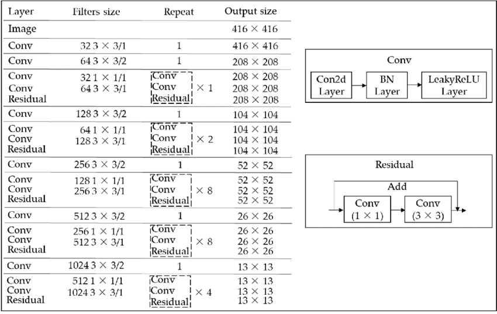
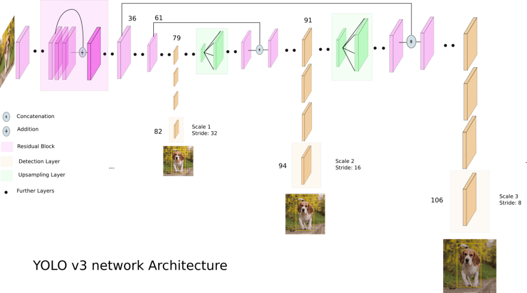

# Bounding box detection

## Authors
 - [Erik Matovič](https://github.com/Matovic)
 - Jakub Horvat 

## Solution
Používame PIE dataset z  [pie_data Python file](./src/pie_data.py) na vytvorenie trénovacích, testovacích a validačných dát. Pre extrahovanie anotácii je vytvorený pie_data súbor.

### 1. Exploratory Data Analysis & Data Transformations
Ukážka z  [PIE dataset videos](https://data.nvision2.eecs.yorku.ca/PIE_dataset/):
 <p align="center">
	
</p>

Z PIE datasetu sme extrahovali a uložili malú časť obrázkov a ich anotácii. Konkrétne trénovacích bolo 1779, validačných 743 a testovacích 1401. Každá časť anotácii obsahuje csv súbor, ktorý pozostáva z dvoch stĺpcov - stĺpec pre cestu k obrázku a stĺpec pre cestu k anotácii k obrázku.

Každý obrázok mal vlastný txt súbor, ktorý pozostával z:
- trieda
- x bboxu
- y bboxu
- šírka bboxu
- výška bboxu


### 2. Data Preprocessing
Na predspracovanie a augmentáciu sme použili knižnicu albumentations, ktorá pri načítaní obrázka augmentuje obrázok s určitou pravdepodobnosťou rôznych možností.
```python3
train_transforms = A.Compose(
    [
        A.LongestMaxSize(max_size=int(IMAGE_SIZE * scale)),
        A.PadIfNeeded(
            min_height=int(IMAGE_SIZE * scale),
            min_width=int(IMAGE_SIZE * scale),
            border_mode=cv2.BORDER_CONSTANT,
        ),
        A.RandomCrop(width=IMAGE_SIZE, height=IMAGE_SIZE),
        A.ColorJitter(brightness=0.6, contrast=0.6, saturation=0.6, hue=0.6, p=0.4),
        A.HorizontalFlip(p=0.5),
        A.Blur(p=0.1),
        A.CLAHE(p=0.1),
        A.Posterize(p=0.1),
        A.ToGray(p=0.1),
        A.ChannelShuffle(p=0.05),
        A.Normalize(mean=[0, 0, 0], std=[1, 1, 1], max_pixel_value=255,),
        ToTensorV2(),
    ],
    bbox_params=A.BboxParams(format="yolo", min_visibility=0.4, label_fields=[],),
)
```
### 3. Model

Na detekciu bounding boxov v obrázku sme použili architektúru inšpirovanú detekčnou sieťou YOLO v3.
 <p align="center">
	
</p>
 <p align="center">
	
</p>

Na vytorenie sme použili konfiguračný list, ktorý definuje štruktúru siete.
```python3
config1 = [
    (32, 3, 1),
    (64, 3, 2),
    ["B", 1],
    (128, 3, 2),
    ["B", 2],
    (256, 3, 2),
    ["B", 8],
    (512, 3, 2),
    ["B", 8],
    (1024, 3, 2),
    ["B", 4],
    (512, 1, 1),
    (1024, 3, 1),
    "S",
    (256, 1, 1),
    "U",
    (256, 1, 1),
    (512, 3, 1),
    "S",
    (128, 1, 1),
    "U",
    (128, 1, 1),
    (256, 3, 1),
    "S",
]
```
Objekty typu touple (a,b,c) označujú konvolučné bloky, kde a je počet filtrov, b je kernel size a c je stride.
Objekty typu označujú reziduálne bloky, kde číslo označuje počet blokov za sebou.
S označuje scale prediction blok, ktorý slúži na predikovanie loss funkcie.
U označuje upsamplovanie obrázku.
```python3
class CNNBlock(nn.Module):
    def __init__(self, in_channels, out_channels, bn_act=True, **kwargs):
        super(CNNBlock, self).__init__()
        self.conv = nn.Conv2d(in_channels, out_channels, bias=not bn_act, **kwargs)
        self.bn = nn.BatchNorm2d(out_channels)
        self.leaky = nn.LeakyReLU(0.1)
        self.use_bn_act = bn_act

    def forward(self, x):
        if self.use_bn_act:
            return self.leaky(self.bn(self.conv(x)))
        else:
            return self.conv(x)
```
```python3
class ResidualBlock(nn.Module):
    def __init__(self, channels, use_residual=True, num_repeats=1):
        super(ResidualBlock, self).__init__()
        self.layers = nn.ModuleList()
        for repeat in range(num_repeats):
            self.layers += [
                nn.Sequential(
                    CNNBlock(channels, channels // 2, kernel_size=1),
                    CNNBlock(channels // 2, channels, kernel_size=3, padding=1),
                )
            ]

        self.use_residual = use_residual
        self.num_repeats = num_repeats

    def forward(self, x):
        for layer in self.layers:
            x = layer(x) + self.use_residual * x

        return x
```
```python3
class ScalePrediction(nn.Module):
    def __init__(self, in_channels, num_classes): #anchors_per_scale
        super(ScalePrediction, self).__init__()
        self.pred = nn.Sequential(
            CNNBlock(in_channels, 2*in_channels, kernel_size=3, padding=1),
            CNNBlock(2*in_channels, (num_classes + 5) * 3, bn_act=False, kernel_size=1),
        )
        self.num_classes = num_classes
        self.anchors_per_scale = 3 #anchors_per_scale

    def forward(self, x):
        return (
            self.pred(x)
                .reshape(x.shape[0], self.anchors_per_scale, self.num_classes + 5, x.shape[2], x.shape[3])
                .permute(0, 1, 3, 4, 2)
        )
```
V triede YOLOv3 sme tieto moduly spojili do jedného modela.
```python3
class YOLOv3(nn.Module):
    def __init__(self, in_channels=3, num_classes=4):
        super(YOLOv3, self).__init__()
        self.num_classes = num_classes
        self.in_channels = in_channels
        self.layers = self._create_conv_layers()

    def forward(self, x):
        outputs = []
        route_connections = []
        for layer in self.layers:
            if isinstance(layer, ScalePrediction):
                outputs.append(layer(x))
                continue

            x = layer(x)

            if isinstance(layer, ResidualBlock) and layer.num_repeats == 8:
                route_connections.append(x)

            elif isinstance(layer, nn.Upsample):
                x = torch.cat([x, route_connections[-1]], dim=1)
                route_connections.pop()

        return outputs


    def _create_conv_layers(self):
        layers = nn.ModuleList()
        in_channels = self.in_channels

        for module in config1:
            if isinstance(module, tuple):
                out_channels, kernel_size, stride = module
                layers.append(
                    CNNBlock(
                        in_channels,
                        out_channels,
                        kernel_size=kernel_size,
                        stride=stride,
                        padding=1 if kernel_size == 3 else 0,
                    )
                )
                in_channels = out_channels

            elif isinstance(module, list):
                num_repeats = module[1]
                layers.append(
                    ResidualBlock(
                        in_channels,
                        num_repeats=num_repeats,
                    )
                )

            elif isinstance(module, str):
                if module == "S":
                    layers += [
                        ResidualBlock(in_channels, use_residual=False, num_repeats=1),
                        CNNBlock(in_channels, in_channels // 2, kernel_size=1),
                        ScalePrediction(in_channels // 2, num_classes=self.num_classes)
                    ]
                    in_channels = in_channels // 2

                elif module == "U":
                    layers.append(
                        nn.Upsample(scale_factor=2),
                    )
                    in_channels = in_channels * 3

        return layers
```

### 4. Training & validation

Ako loss funkciu sme použili odporúčasnú funkciu pre YOLO v3, a to
$L = \lambda_{noobject}*L_{noobject}+\lambda_{object}*L_{object}+\lambda_{bbox}*L_{bbox}+\lambda_{class}*L_{class}$, kde lambda je koeficient váhy danej čiastkovej loss funkcie. 
$L_{noobject}$ je stratová funkcia pre anchor, ktorá neobsahuje žiaden objekt. 
$L_{object}$ je stratová funkcia pre kotvy, ktoré majú priradený objekt a cheme pre nich predikovať bounding box.
$L_{bbox}$ je stratová funkcia pre predikovanú a skutočnú pozíciu bounding boxov.
$L_{class}$ je stratová funkcia pre správne klasifikovanie bboxu triede.

Ako optimizer je použitý Adam. Počet epôch je 12.


### 5. Testing

## Conclusion
Na vytvorenie detekčnej siete sme použili sieť s podobnou architektúrou ako YOLO v3. Na trénovanie modelu sme použili kaggle notebook, pretože naše stroje nemali dostatočnú pamäť. TODO dorob ked bude wandb


## Changelog
