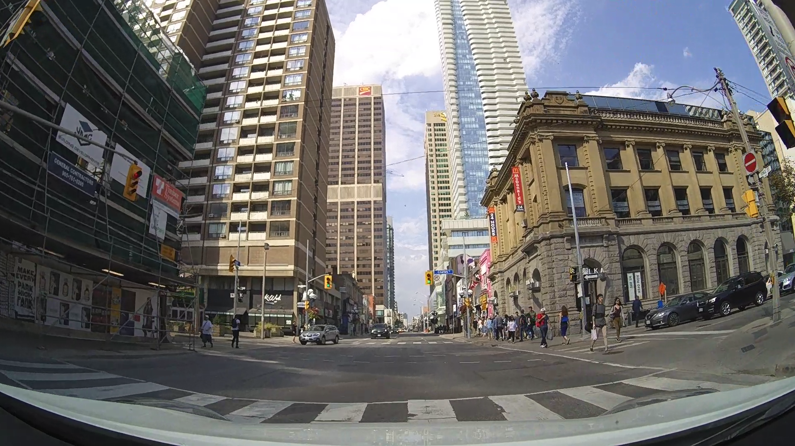

# Bounding box detection

## Authors
 - [Erik Matovič](https://github.com/Matovic)
 - Jakub Horvat 

## Solution
Používame PIE dataset z  [pie_data Python file](./src/pie_data.py) na vytvorenie trénovacích, testovacích a validačných dát. Pre extrahovanie anotácii je vytvorený pie_data súbor.

### 1. Exploratory Data Analysis & Data Transformations
Ukážka z  [PIE dataset videos](https://data.nvision2.eecs.yorku.ca/PIE_dataset/):
 <p align="center">
	
</p>

Z PIE datasetu sme extrahovali a uložili malú časť obrázkov a ich anotácii. Konkrétne trénovacích bolo 1779, validačných 743 a testovacích 1401. Každá časť anotácii obsahuje csv súbor, ktorý pozostáva z dvoch stĺpcov - stĺpec pre cestu k obrázku a stĺpec pre cestu k anotácii k obrázku.

Každý obrázok mal vlastný txt súbor, ktorý pozostával z:
- trieda
- x bboxu
- y bboxu
- šírka bboxu
- výška bboxu


### 2. Data Preprocessing
Na predspracovanie a augmentáciu sme použili knižnicu albumentations, ktorá pri načítaní obrázka augmentuje obrázok s určitou pravdepodobnosťou rôznych možností.
```python3
train_transforms = A.Compose(
    [
        A.LongestMaxSize(max_size=int(IMAGE_SIZE * scale)),
        A.PadIfNeeded(
            min_height=int(IMAGE_SIZE * scale),
            min_width=int(IMAGE_SIZE * scale),
            border_mode=cv2.BORDER_CONSTANT,
        ),
        A.RandomCrop(width=IMAGE_SIZE, height=IMAGE_SIZE),
        A.ColorJitter(brightness=0.6, contrast=0.6, saturation=0.6, hue=0.6, p=0.4),
        A.HorizontalFlip(p=0.5),
        A.Blur(p=0.1),
        A.CLAHE(p=0.1),
        A.Posterize(p=0.1),
        A.ToGray(p=0.1),
        A.ChannelShuffle(p=0.05),
        A.Normalize(mean=[0, 0, 0], std=[1, 1, 1], max_pixel_value=255,),
        ToTensorV2(),
    ],
    bbox_params=A.BboxParams(format="yolo", min_visibility=0.4, label_fields=[],),
)
```
### 3. Model

Na detekciu bounding boxov v obrázku sme použili architektúru inšpirovanú detekčnou sieťou YOLO v3.
 <p align="center">
	
</p>
 <p align="center">
	
</p>

Na vytorenie sme použili konfiguračný list, ktorý definuje štruktúru siete.
```python3
config1 = [
    (32, 3, 1),
    (64, 3, 2),
    ["B", 1],
    (128, 3, 2),
    ["B", 2],
    (256, 3, 2),
    ["B", 8],
    (512, 3, 2),
    ["B", 8],
    (1024, 3, 2),
    ["B", 4],
    (512, 1, 1),
    (1024, 3, 1),
    "S",
    (256, 1, 1),
    "U",
    (256, 1, 1),
    (512, 3, 1),
    "S",
    (128, 1, 1),
    "U",
    (128, 1, 1),
    (256, 3, 1),
    "S",
]
```
Objekty typu touple (a,b,c) označujú konvolučné bloky, kde a je počet filtrov, b je kernel size a c je stride.
Objekty typu označujú reziduálne bloky, kde číslo označuje počet blokov za sebou.
S označuje scale prediction blok, ktorý slúži na predikovanie loss funkcie.
U označuje upsamplovanie obrázku.
```python3
class CNNBlock(nn.Module):
    def __init__(self, in_channels, out_channels, bn_act=True, **kwargs):
        super(CNNBlock, self).__init__()
        self.conv = nn.Conv2d(in_channels, out_channels, bias=not bn_act, **kwargs)
        self.bn = nn.BatchNorm2d(out_channels)
        self.leaky = nn.LeakyReLU(0.1)
        self.use_bn_act = bn_act

    def forward(self, x):
        if self.use_bn_act:
            return self.leaky(self.bn(self.conv(x)))
        else:
            return self.conv(x)
```
```python3
class ResidualBlock(nn.Module):
    def __init__(self, channels, use_residual=True, num_repeats=1):
        super(ResidualBlock, self).__init__()
        self.layers = nn.ModuleList()
        for repeat in range(num_repeats):
            self.layers += [
                nn.Sequential(
                    CNNBlock(channels, channels // 2, kernel_size=1),
                    CNNBlock(channels // 2, channels, kernel_size=3, padding=1),
                )
            ]

        self.use_residual = use_residual
        self.num_repeats = num_repeats

    def forward(self, x):
        for layer in self.layers:
            x = layer(x) + self.use_residual * x

        return x
```
```python3
class ScalePrediction(nn.Module):
    def __init__(self, in_channels, num_classes): #anchors_per_scale
        super(ScalePrediction, self).__init__()
        self.pred = nn.Sequential(
            CNNBlock(in_channels, 2*in_channels, kernel_size=3, padding=1),
            CNNBlock(2*in_channels, (num_classes + 5) * 3, bn_act=False, kernel_size=1),
        )
        self.num_classes = num_classes
        self.anchors_per_scale = 3 #anchors_per_scale

    def forward(self, x):
        return (
            self.pred(x)
                .reshape(x.shape[0], self.anchors_per_scale, self.num_classes + 5, x.shape[2], x.shape[3])
                .permute(0, 1, 3, 4, 2)
        )
```
V triede YOLOv3 sme tieto moduly spojili do jedného modela.
```python3
class YOLOv3(nn.Module):
    def __init__(self, in_channels=3, num_classes=4):
        super(YOLOv3, self).__init__()
        self.num_classes = num_classes
        self.in_channels = in_channels
        self.layers = self._create_conv_layers()

    def forward(self, x):
        outputs = []
        route_connections = []
        for layer in self.layers:
            if isinstance(layer, ScalePrediction):
                outputs.append(layer(x))
                continue

            x = layer(x)

            if isinstance(layer, ResidualBlock) and layer.num_repeats == 8:
                route_connections.append(x)

            elif isinstance(layer, nn.Upsample):
                x = torch.cat([x, route_connections[-1]], dim=1)
                route_connections.pop()

        return outputs


    def _create_conv_layers(self):
        layers = nn.ModuleList()
        in_channels = self.in_channels

        for module in config1:
            if isinstance(module, tuple):
                out_channels, kernel_size, stride = module
                layers.append(
                    CNNBlock(
                        in_channels,
                        out_channels,
                        kernel_size=kernel_size,
                        stride=stride,
                        padding=1 if kernel_size == 3 else 0,
                    )
                )
                in_channels = out_channels

            elif isinstance(module, list):
                num_repeats = module[1]
                layers.append(
                    ResidualBlock(
                        in_channels,
                        num_repeats=num_repeats,
                    )
                )

            elif isinstance(module, str):
                if module == "S":
                    layers += [
                        ResidualBlock(in_channels, use_residual=False, num_repeats=1),
                        CNNBlock(in_channels, in_channels // 2, kernel_size=1),
                        ScalePrediction(in_channels // 2, num_classes=self.num_classes)
                    ]
                    in_channels = in_channels // 2

                elif module == "U":
                    layers.append(
                        nn.Upsample(scale_factor=2),
                    )
                    in_channels = in_channels * 3

        return layers
```

### 4. Training & validation

Ako loss funkciu sme použili odporúčasnú funkciu pre YOLO v3, a to
$L = \lambda_{noobject}*L_{noobject}+\lambda_{object}*L_{object}+\lambda_{bbox}*L_{bbox}+\lambda_{class}*L_{class}$, kde lambda je koeficient váhy danej čiastkovej loss funkcie. 
$L_{noobject}$ je stratová funkcia pre anchor, ktorá neobsahuje žiaden objekt. 
$L_{object}$ je stratová funkcia pre kotvy, ktoré majú priradený objekt a cheme pre nich predikovať bounding box.
$L_{bbox}$ je stratová funkcia pre predikovanú a skutočnú pozíciu bounding boxov.
$L_{class}$ je stratová funkcia pre správne klasifikovanie bboxu triede.

Ako optimizer je použitý Adam. Počet epôch je 12.

```python3

```


### 5. Testing

```python3
def evaluation(model, test_dl):
    """
    evaluation
    """    
    y_test_all_action, y_test_all_gender, y_test_all_cross, y_test_all_look = list(), list(), list(), list()
    y_all_action, y_all_gender, y_all_cross, y_all_look = list(), list(), list(), list()
    # total_action, total_gesture, total_cross, total_look = 0, 0, 0, 0
    correct_action, correct_gender, correct_cross, correct_look = 0, 0, 0, 0
    # disable gradient calculation
    with torch.no_grad():
        # enumerate mini batches
        for _, sample in enumerate(test_dl):
            # get X and y with index from sample
            X_batch, y_batch_action, y_batch_gender, \
                y_batch_look, y_batch_cross, idx = sample['data'], sample['label_action'], \
                    sample['label_gender'], sample['label_look'], sample['label_cross'], \
                        sample['img_idx']
            
            X_batch, y_batch_action, y_batch_gender, y_batch_look, y_batch_cross = \
                X_batch.to(device), y_batch_action.to(device), y_batch_gender.to(device), \
                    y_batch_look.to(device), y_batch_cross.to(device)
                     
            # compute the model output
            # Make prediction logits with model
            y_hat = model(X_batch)
            y_action = y_hat['label_action']
            y_gender = y_hat['label_gender']
            y_look = y_hat['label_look']
            y_cross = y_hat['label_cross']
            
            y_cross_ = model.logSoftmax(y_cross) 
            true_cross_max = torch.argmax(y_cross_, dim=1)

            _, y_action_ = torch.max(y_action, dim=1) #.round().int()
            _, y_gender_ = torch.max(y_gender, dim=1) #.round().int()
            _, y_look_ = torch.max(y_look, dim=1) #.round().int()
            
            # accuracies
            true_action = accuracy_fn(y_action_, y_batch_action)
            true_gender = accuracy_fn(y_gender_, y_batch_gender)
            true_look = accuracy_fn(y_look_, y_batch_look)
            true_cross = accuracy_fn(true_cross_max, y_batch_cross)
        
            # update predictions stats
            y_all_action.extend(y_action_.cpu().numpy())
            y_all_gender.extend(y_gender_.cpu().numpy())
            y_all_look.extend(y_look_.cpu().numpy())
            y_all_cross.extend(true_cross_max.cpu().numpy())

            # update batch y stats
            y_test_all_action.extend(y_batch_action.cpu().numpy())
            y_test_all_gender.extend(y_batch_gender.cpu().numpy())
            y_test_all_look.extend(y_batch_look.cpu().numpy())
            y_test_all_cross.extend(y_batch_cross.cpu().numpy())

            correct_action += true_action
            correct_gender += true_gender
            correct_look += true_look
            correct_cross += true_cross
            
    report_action = classification_report(y_test_all_action, y_all_action, target_names=['0', '1'])
    report_gender = classification_report(y_test_all_gender, y_all_gender, target_names=['0', '1'])
    report_look = classification_report(y_test_all_look, y_all_look, target_names=['0', '1'])
    report_cross = classification_report(y_test_all_cross, y_all_cross, target_names=['0', '1', '2'])

    matrix_action = confusion_matrix(y_test_all_action, y_all_action)
    matrix_gender = confusion_matrix(y_test_all_gender, y_all_gender)
    matrix_look = confusion_matrix(y_test_all_look, y_all_look)
    matrix_cross = confusion_matrix(y_test_all_cross, y_all_cross)
    
    matrix_action_display = ConfusionMatrixDisplay(matrix_action, display_labels=['0', '1'])
    matrix_gender_display = ConfusionMatrixDisplay(matrix_gender, display_labels=['0', '1'])
    matrix_look_display = ConfusionMatrixDisplay(matrix_look, display_labels=['0', '1'])
    matrix_cross_display = ConfusionMatrixDisplay(matrix_cross, display_labels=['0', '1', '2'])

    return report_action, report_gender, report_look, report_cross, \
        matrix_action_display, matrix_gender_display, \
            matrix_look_display, matrix_cross_display
```

<p align="center">
	
	
	
	
</p>


## Conclusion
Na vytvorenie detekčnej siete sme použili sieť s podobnou architektúrou ako YOLO v3. Na trénovanie modelu sme použili kaggle notebook, pretože naše stroje nemali dostatočnú pamäť. TODO dorob ked bude wandb


## Changelog
05.04.2023 - spravené 
 - Exploratory Data Analysis 
 - Rozframeovanie videí na snímky 
    - Iba anotované snímky nakoľko celý dataset by mal cca 3TB 
    - Vytiahnuté niekoľkých anotovaných snímok(zhruba 1000) nakoľko všetky frame-y majú cca 1TB 
    - Vytiahnutie behaviorálnych anotácií chodcov z XML a spravenie CSV súboru z toho 
        - Action - stojí alebo chodí, triedy 0-1 
        - Gesture – pohyby rúk, hlavy alebo iné, triedy: 0-5 
        - Look - pozerá sa do kamery alebo nie, triedy: 0,1 
        - Cross – ide cez prechod alebo nie alebo je to irelvantné, triedy: 0,1,2 
 - Načítanie datasetu a anotácií 
 - Rozdelenie datasetu na trénovací, validačný a testovací 
 - Návrh architektúry CNN 
    - Inšpirácia VGG 
 - PyTorch 

05.04.2023 - TO DO 
 - Moznosti riesenia:  
    - pomocou regresiu  
    - rozvetvenu siet a potom z nich dalsie mlp 
    - mozno aj rezidualne bloky do siete 
 - je potrebne predspracovanie obrazkov - padding, warp, upscaling 
 - Mozno aj do grayscale, mozno aj augmentovat obrazky - pre zvacsenie datasetu 
 - Vytiahnuť chodcov pomocou Boundig Boxov a tá časť obrázkov pôjde na vstup CNN a toho chodca budeme klasifikovať do tried action, gesture, look a cross 
 - Tréning 
 - Validácia 
 - Testovanie 
 - Early stopping 
 - WandB 

12.04.2023 - spravené 
 - Rozbehanie WandB a vygenerovanie pdf report 
 - EDA - dokončenie 
    - Výber 4 finálnych tried kvôli nevyváženosti dátam 
    - Pridanie grafov do dokumentácie 
 - Data Transformation 
    - Videa na frames 
    - Rozdelenie frames na train-dev-test 
    - Extrahovanie unikátnych chodcov zo snímok pomocou BBoxov, unikátnych preto, aby sme sa vyhli opakujúcim sa chodcom, pretože dáta sú z videí a obávali sme sa preučenia 
    - Transformácia do grayscale 
    - Warp chodcov na 64x64 
 - Augmentácia dát 
    - Naklonovanie a rotácia obrázkov tých tried, ktoré sú nevyvážené, to nám ale prinášalo imbalance aj do iných tried nakoľko jeden chodec má až 4 triedy a každá trieda ma niekoľko labels 
 - Experimentovanie s hyperparametrami prostredníctvom WandB 
    - Šírka dense layers  
    - Batch size 
    - Počet epôch 
    - Learning rate 
    - Momentum pre SGD optimalizátor 
- Experimentovanie s architektúrou siete (VGG,ResNet) 
    - Pridanie reziduálnych blokov 
    - Pridanie, odstránenie skrytých vrstiev 
- Pridanie šírky dense vrstvy 
- Pridanie hĺbky 
    - Dense – 6 vrstiev 
    - CNN 64x64 -> Leaky Relu -> CNN 64x64 -> Leaky Relu -> Maxpool 2x 
- Dropout na úrovni 0.20 
- Pridanie early stopping 
- Rozbehanie na najlepších parametroch 
- Evaluácia 
    - Classification report 
    - Confusion matrix 
- Klasifikácia chodca do 4 tried – viac-výstupný klasifikátor - chodec chodí/stojí, pohlavie chodca, pozeranie chodca do kamery a prechádzanie chodca cez cestu 
- Binary Cross Entropy Loss function so Sigmoid layer pre binárne klasifikácie a Cross Entropy pre multi classification(cross trieda – crossing, not-crossing, crossing irrelevant) 
- Zverejnený GitHub public repozitár s dokumentáciou prostredníctvom README
